# skinet
本篇參考自Udemy線上教學影片所練習之作品，前端使用Angular，後端使用asp.net core，緩存使用Docker radius，Card Api使用stripe，實作購物車。
## 成果
###### 首頁
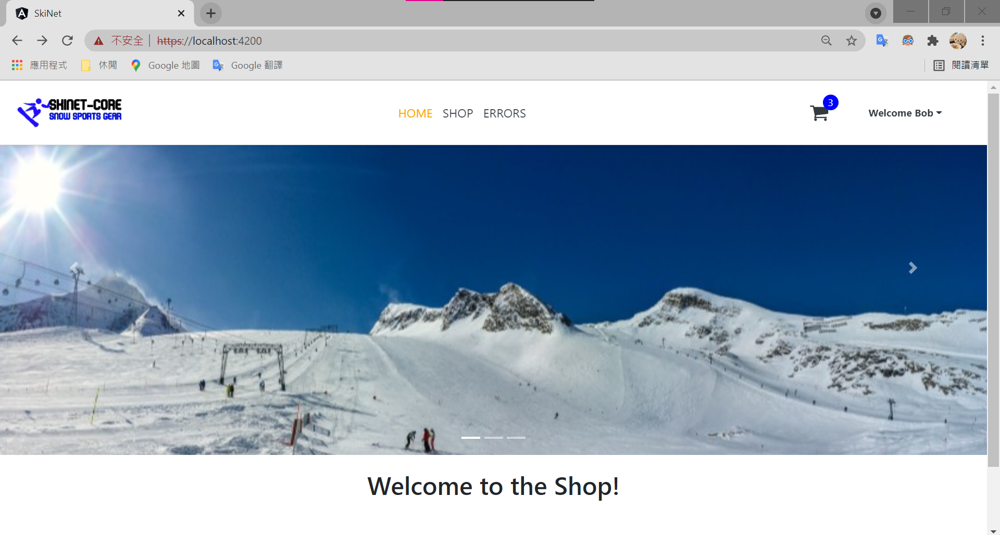
###### 購物車
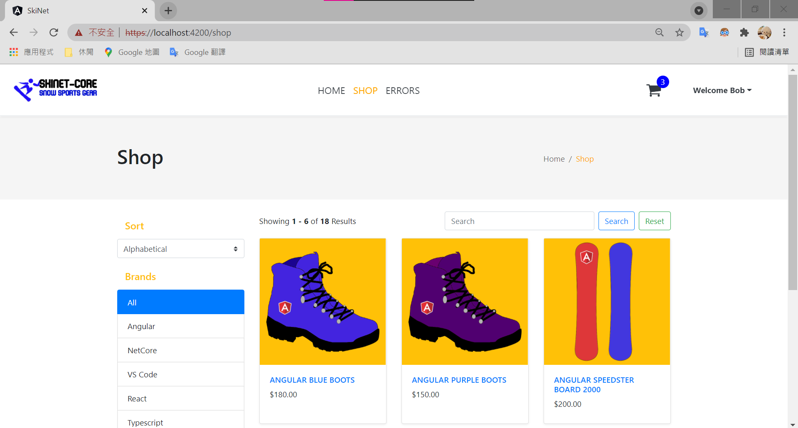
###### 購物車內容
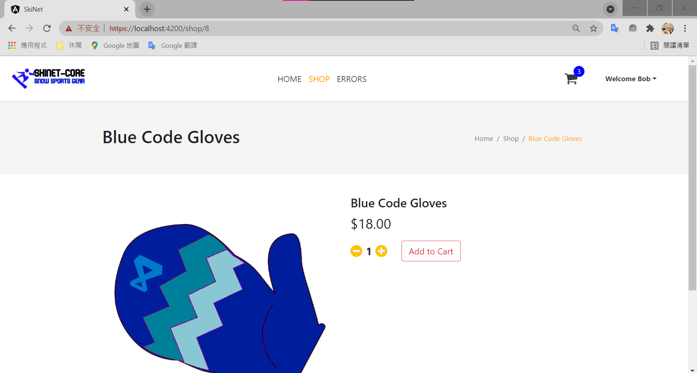
###### 結帳
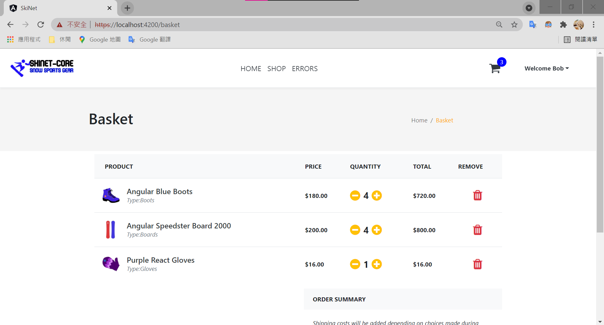
###### 地址
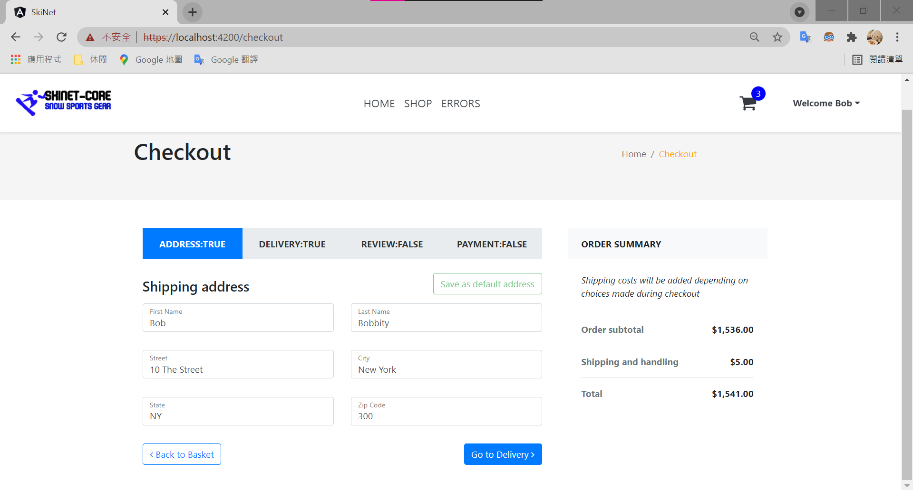
###### 運費
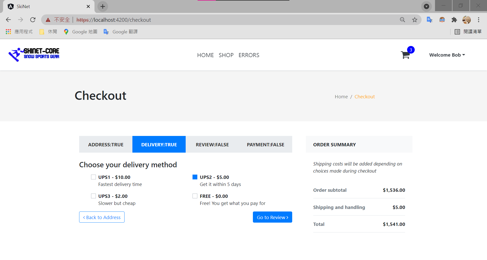
###### 結帳商品
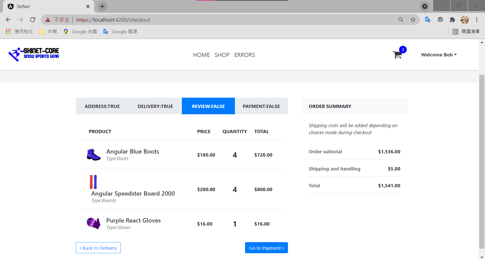
###### 刷卡
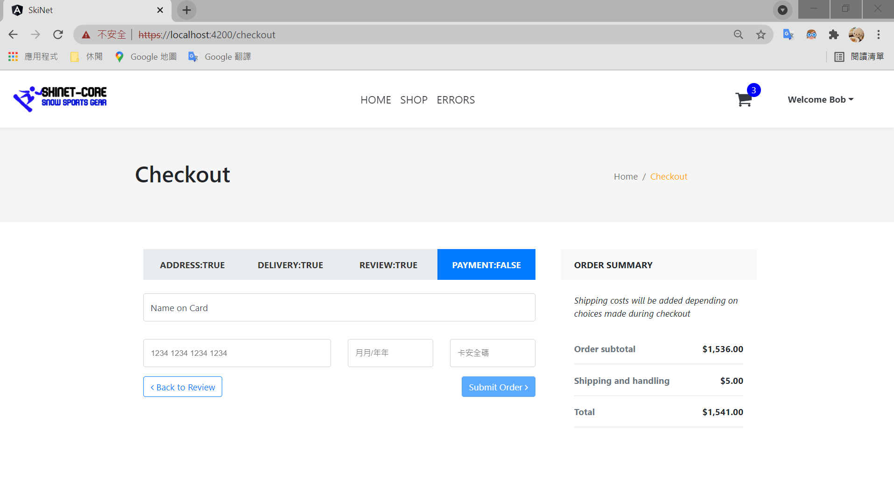
###### 刷卡驗證
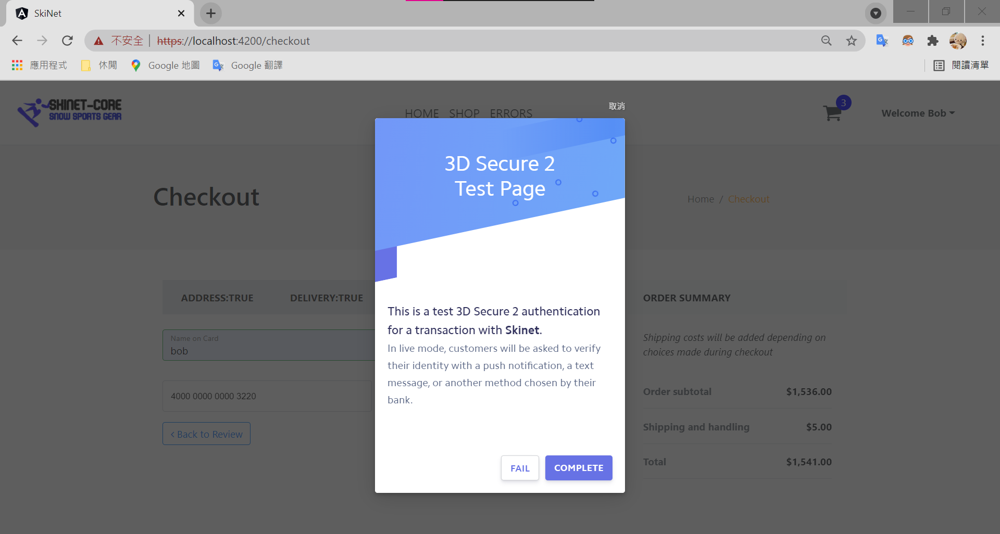
###### 成功
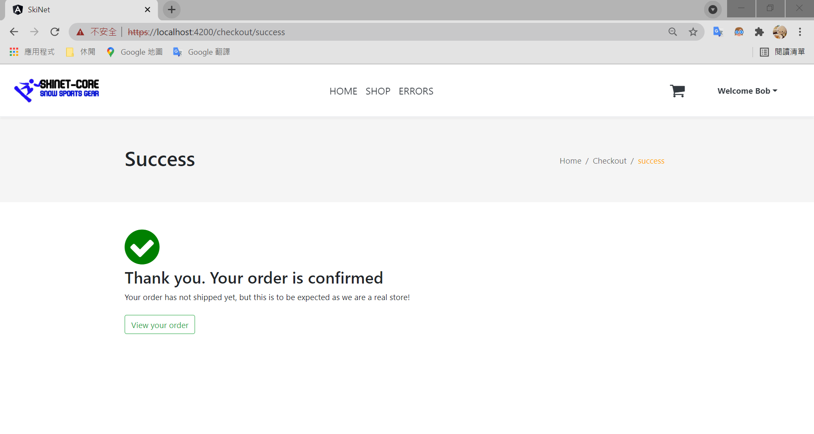
###### stripe查看付款結果
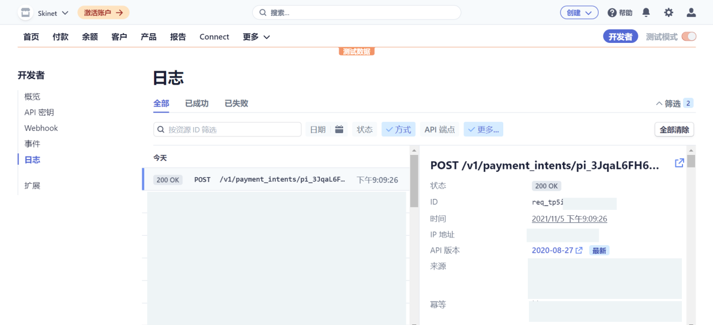

## 資料來源
Learn to build an e-commerce app with .Net Core and Angular
